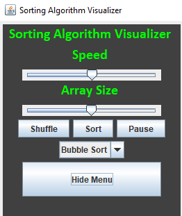
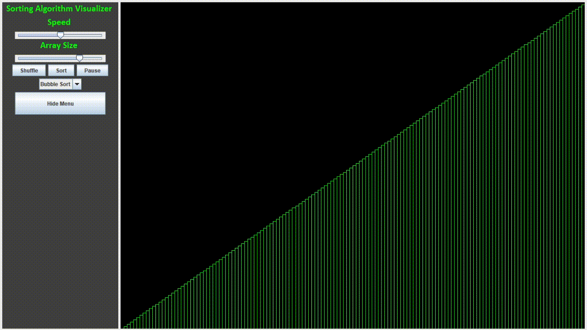

# Sorting Algorithm Visualizer

Java Sorting Visualizer using Swing Components | Swing Worker | Graphics 2D

Sorting algorithm visualizer is created using Java and can be used to see the working of different sorting algorithms visually.

## Demo

## Screenshots

Screenshot of the Menu

MergeSort working :

Shows the different actions that can be performed by the user.

* Shuffle the already sorted array
* Select the sorting algorithm
* Sort the array
* Pause the sorting 
* Change the speed of the sorting
  
## Sorting Algorithms

* Bubble Sort
* Quick Sort
* Merge Sort

## Skills Learned
* Multi-Threading using Swing Worker
* Customising Swing Components
* Graphics 2D
* Apply Sorting Algorithms
* Git/Github